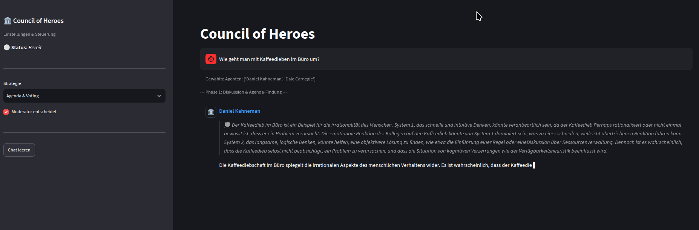

# 🏛️ Council of Heroes (COH)

> **Project Status:** pre-pre-alpha (oder wie wir es nennen: Version -1.0).  
> Wir sind noch nicht mal bei Alpha. Das hier ist maximal Aleph-0 ($\aleph_0$), und selbst das ist optimistisch gerechnet.

Das Projekt mit dem Namen **„Council of Heroes“** (zu Deutsch: *Rat der Helden* oder *Expertenrat*) ist ein intelligentes, interaktives Diskussions- und Analyse-System.

Man kann sich das Tool wie einen digitalen runden Tisch vorstellen, an dem weltbekannte Experten, Autoren und Strategen sitzen. Wenn du dort eine Frage stellst, ein Problem schilderst oder einen Text einreichst, erwachen diese Experten zum Leben, diskutieren miteinander, hinterfragen deine Ideen oder stimmen über Lösungswege ab – jeder völlig im Stil seiner echten Philosophie und Persönlichkeit.

## Wofür ist es gedacht?

* **Rückendeckung bei Entscheidungen:** Wenn du vor einer schwierigen geschäftlichen oder persönlichen Entscheidung stehst (z. B. Verhandlungen, Strategiefragen, Kommunikationsprobleme), lässt du sie von verschiedenen Denkern beleuchten.
* **Kritisches Feedback (Dokumenten-Review):** Du reichst einen eigenen Text oder Entwurf ein und bekommst fundierte, fachliche Kritik – zum Beispiel aus psychologischer Sicht, aus Sicht der Verhandlungspsychologie oder der Rhetorik.
* **Verschiedene Perspektiven erleben:** Statt nur eine generische KI-Antwort zu bekommen, siehst du, wie unterschiedliche Experten (z. B. Dale Carnegie, Daniel Kahneman, Jack Nasher oder Robert Cialdini) völlig kontroverse Ansätze zu demselben Thema vertreten.

---

## ⚙️ Ein bisschen Technik (wie es funktioniert)

Hinter den Kulissen ist das Ganze so aufgebaut:

1. **Die Experten-Persönlichkeiten:** Jeder Experte hat eine eigene Wissensbasis (z. B. aus seinen Büchern). Das System nutzt eine sogenannte **RAG-Architektur** (Retrieval-Augmented Generation): Es durchsucht im Hintergrund blitzschnell die echten Texte und Schriften des jeweiligen Experten, um passende Zitate und Argumente zu finden, statt sich einfach nur etwas auszudenken.
2. **Der Moderator & Diskussionsphasen:** Es gibt einen intelligenten „Moderator“, der automatisch entscheidet, welche Experten für deine Frage am besten geeignet sind. Die Diskussion läuft in Phasen ab:
    * **Phase 1 (Statements):** Jeder ausgewählte Experte hält eine kurze Rede aus seiner Sicht.
    * **Phase 2 (Replik):** Die Experten hören (bzw. lesen), was die anderen gesagt haben, und reagieren direkt aufeinander – sie widersprechen sich, ergänzen sich oder stimmen zu.
    * **Alternativ-Modus (Agenda & Voting):** Die Experten schlagen konkrete Handlungspunkte vor und stimmen am Ende per Ja/Nein formell darüber ab.

**Demo: So sieht eine Voting-Runde aus**
[COH_Voting.webm](https://github.com/user-attachments/assets/f4e5996c-a40c-4ff4-b1b3-8b046882c6c9)

3. **Das Innenleben (Inner Monologue):** Bevor ein Experte etwas „laut“ in die Runde sagt, lässt das System ihn in einem internen Monolog (Gedankengang) seine Strategie planen. Das macht die Antworten extrem nachvollziehbar.
4. **Lokale Ausführung & Benutzeroberfläche:** Das System läuft komplett lokal auf dem eigenen Computer und verbindet sich mit einer lokalen KI. Für die Bedienung gibt es eine schicke Weboberfläche (wahlweise im klassischen Chat-Design oder über Streamlit), in der man live zusehen kann, wie die Experten nacheinander zu "denken" und zu schreiben beginnen.

**Demo: Organische Diskussion**

[COH_discussion.webm](https://github.com/user-attachments/assets/f8304e81-31c3-4e72-899d-2b819cf0450a)
